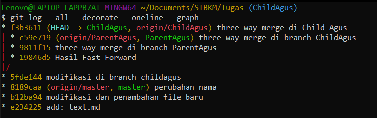

Fast-Forward 
1. Membuat Branch

pembuatan branch ParentAgus dan Child Agus
2. Memindahkan isi branch

Memindahkan seluruh isi master ke ParentAgus seolah olah ParentAgus menjadi main atau master saat ini
3. Memodifikasi file di ChildAgus

setelah berpindah ke branach childagus kita memodifikasi file dan kira add dan commit 
4. Push file dari ChildAgus

Dikarenakan belum ada branch di remote maka kita tambahkan dlu dengan cara 
git push --set-upstream origin ChildAgus
5. Melakukan merge

Setelah berpindah ke ParentAgus maka kira melakukan merge dengan ChildAgus dan Fast Forward telah berhasil
6. Push ke remote

dikarenakan belum ada ParenAgus di remote github maka kita tambahkan dengan cara git push --set-upstream origin ParentAgus
7. hasil

THREE WAY MERGING
1. Memodifikasi file di dalam ChildAgus

melakukan modifikasi file pada ChildAgus melakukan add,commit dan push

log nya
2. melakukan pull

kita mencoba melakukan pull dari ParentAgus ke ChildAgus dan menemukan konflik
3. tampilan vs code
akan menunjukan tindakan yang kita pilih atas perubahan tersebut
4. Menambahkan setelah merging

setelah memilih tindakan yang ada sekarang kita add, dan comit serta push
5. Hasil log

6. Membuat pull request

7. git pull diterminal

